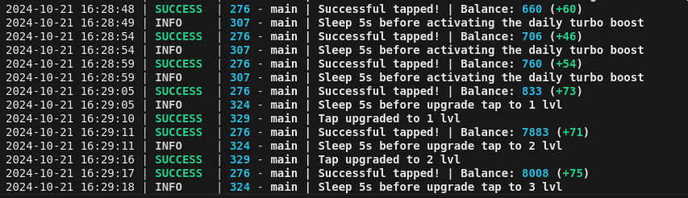

[](https://t.me/hhhscvx)




## Functionality
| Functional                                                     | Supported |
|----------------------------------------------------------------|:---------:|
| Multithreading                                                 |     ✅     |
| Binding a proxy to a session                                   |     ✅     |
| Auto-purchase of items if you have coins (tap, energy, charge) |     ✅     |
| Auto Claiming                                                  |     ✅     |
| Random sleep time between clicks                               |     ✅     |
| Random number of clicks per request                            |     ✅     |
| Support tdata / pyrogram .session / telethon .session          |     ✅     |

## [Change Settings](https://github.com/hhhscvx/YumifyBot/blob/master/bot/config/config.py)
| Настройка                | Описание                                                                               |
|--------------------------|----------------------------------------------------------------------------------------|
| **API_ID / API_HASH**    | Platform data from which to launch a Telegram session (stock - Android)                |

## Installation
You can download [**Repository**](https://github.com/hhhscvx/YumifyBot) by cloning it to your system and installing the necessary dependencies:
```shell
~ >>> git clone https://github.com/hhhscvx/YumifyBot.git
~ >>> cd YumifyBot

#Linux
~/YumifyBot >>> python3 -m venv venv
~/YumifyBot >>> source venv/bin/activate
~/YumifyBot >>> pip3 install -r requirements.txt
~/YumifyBot >>> cp .env-example .env
~/YumifyBot >>> nano .env # Here you must specify your API_ID and API_HASH , the rest is taken by default
~/YumifyBot >>> python3 main.py

#Windows
~/YumifyBot >>> python -m venv venv
~/YumifyBot >>> venv\Scripts\activate
~/YumifyBot >>> pip install -r requirements.txt
~/YumifyBot >>> copy .env-example .env
~/YumifyBot >>> # Specify your API_ID and API_HASH, the rest is taken by default
~/YumifyBot >>> python main.py
```
